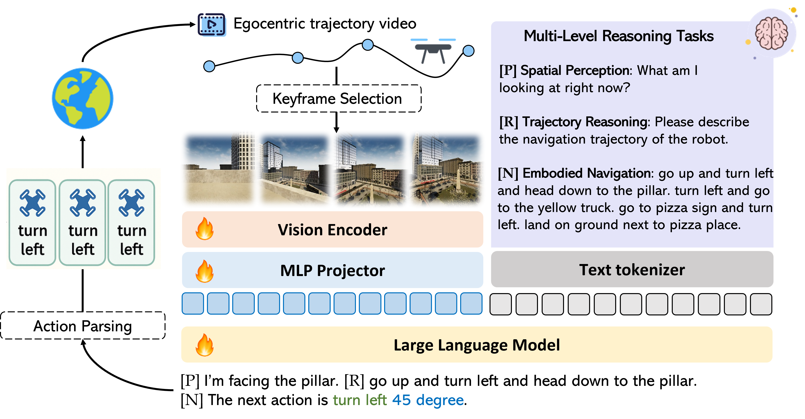

<div align="center">

# AeroAct: Aerial Vision-Language Navigation with a Unified Framework for Spatial, Temporal and Embodied Reasoning

<p align="center">
	<a href="https://arxiv.org/abs/2512.08639">
		
	</a>
	<a href="./LICENSE">
		
	</a>
	
</p>

<p align="center">
	
</p>

</div>

## ? News

- **Apr 8, 2026**: We open-source the AeroAct training code.

## ? Introduction

We present a unified aerial VLN framework that operates solely on egocentric monocular RGB observations and natural language instructions. The model formulates navigation as a next-token prediction problem, jointly optimizing spatial perception, trajectory reasoning, and action prediction through prompt-guided multi-task learning.

<p align="center">
	
</p>

## ? Table of Contents
- [Installation](#installation)
- [Dataset Preparation](#data-preparation)
- [Training](#training)
- [Evaluation](#evaluation)
- [Performance](#performance)
- [Acknowledgement](#acknowledgement)
- [Citation](#citation)
- [License](#license)

## ?? Installation
To build environment for training AeroAct, please run the following:

```bash
./environment_setup.sh aeroact
conda activate aeroact
```

## ? Data Preparation

This project uses three groups of data: navigation trajectories for action prediction, spatial VQA data for egocentric reasoning, and trajectory-summary annotations for sub-trajectory understanding. Please organize the resources exactly as shown below before launching training.

### 1. AerialVLN Data

This is the main navigation dataset used for action prediction. It contains step-wise tuples after action merging and keyframe selection.

Source the raw data from [AirVLN](https://github.com/AirVLN/AirVLN/tree/main), then place the processed annotations and raw frames under `Dataset/AerialVLN-Dataset/`.

The code expects the following files:
- `Dataset/AerialVLN-Dataset/Raw_data/aerialvln-s/`
- `Dataset/AerialVLN-Dataset/data/aerialvln-s/train_merged_triple.json`
- `Dataset/AerialVLN-Dataset/data/aerialvln-s/train_episode2instruction.json`
- `Dataset/AerialVLN-Dataset/data/aerialvln-s/train_action_prob_weight.json`
- `Dataset/AerialVLN-Dataset/data/aerialvln-s/train_episodes2idx_merge.json`

These JSON files provide instruction mapping, action reweighting, and merged frame indices used by [llava/data/dataset.py](llava/data/dataset.py).

### 2. VQA Data

This data is used for drone egocentric spatial reasoning and spatial-relation QA pairs. It combines Open3DVQA-style annotations with a spatial subset of ShareGPT4V-SFT.

Download the Open3DVQA content from [EmbodiedCity/Open3DVQA-v2](https://huggingface.co/datasets/EmbodiedCity/Open3DVQA-v2) and arrange it under `Dataset/VQA-Dataset/Open3DVQA`. 

For the GQA-style spatial subset, download the image assets from [GQA](https://downloads.cs.stanford.edu/nlp/data/gqa/images.zip) and prepare the ShareGPT4V-SFT subset under `Dataset/VQA-Dataset/ShareGPT4V-SFT`.

### 3. Trajectory Summary Data

This is the human-annotated sub-trajectory segmentation and progress-summary data used to train the trajectory-summary branch. In the current code, it is consumed together with the AerialVLN raw frames and auxiliary JSON files listed above.

We currently provide a demo split to quickly test and sanity-check the training code.

The data should be placed in `Dataset/AerialVLN-Dataset/data/aerialvln-s/`, together with `labeled_segments.json` and `subgoal_pointer_list.json`.

### Expected Directory Structure

```graphql
Dataset
©À©¤ AerialVLN-Dataset
|  ©À©¤ data
|  |  ©¸©¤ aerialvln-s
|  |     ©À©¤ train_merged_triple.json
|  |     ©À©¤ subgoal_pointer_list.json
|  |     ©À©¤ train_episode2instruction.json
|  |     ©À©¤ train_action_prob_weight.json
|  |     ©À©¤ train_episodes2idx_merge.json
|  |     ©¸©¤ labeled_segments.json
|  ©¸©¤ Raw_data
|     ©¸©¤ aerialvln-s
|        ©¸©¤ <episode_id>
|           ©¸©¤ rgb
|              ©À©¤ frame_000.jpg
|              ©À©¤ frame_001.jpg
|              ©¸©¤ ...
©¸©¤ VQA-Dataset
	©À©¤ Open3DVQA
	|  ©¸©¤ O3DVQA
	|     ©À©¤ EmbodiedCity
	|     |  ©¸©¤ Wuhan
	|     |     ©À©¤ merged_qa.json
	|     |     ©¸©¤ rgb
	|     ©¸©¤ UrbanScene
	|        ©À©¤ Campus
	|        |  ©À©¤ merged_qa.json
	|        |  ©¸©¤ rgb
	|        ©¸©¤ Residence
	|           ©À©¤ merged_qa.json
	|           ©¸©¤ rgb
	©¸©¤ ShareGPT4V-SFT
		©À©¤ sharegpt4v_gqa_spatial_outdoor.json
		©¸©¤ gqa
```

## ? Training
To launch training, please run the following command:

```bash
# only train on aerivln dataset
bash script/train_aerialvln.sh airvln_merge_triple_updated
# for training with all datasets, please modify llava/data/datasets_mixture.py to include the datasets you want, and make sure to prepare the data for those datasets as well.
bash script/train_aerialvln.sh airvln_merge_triple_updated+airvln_subtraj_sum_updated+open3dvqa_embodiedcity_wuhan+open3dvqa_urban_scene_campus+open3dvqa_urban_scene_residence+gqa_spatial
```

## ? Evaluation

To evaluate a trained AeroAct checkpoint on AerialVLN, first start the simulator server, then run the evaluation script. Before running evaluation, please configure the test environment and simulator platform according to [AirVLN](https://github.com/AirVLN/AirVLN/tree/main).

```bash
cd AirVLN
nohup python airsim_plugin/AirVLNSimulatorServerTool.py --gpus 0 &
cd ..
# bash script/eval_aeriavln.sh checkpoints/exp1 0.2
bash script/eval_aeriavln.sh <model_path> <temperature>
```

## ? Performance

<p align="center"><strong>Table 1 | Main comparison results on AerialVLN benchmark.</strong></p>

<table>
	<thead>
		<tr>
			<th rowspan="2">Method</th>
			<th rowspan="2">Observation</th>
			<th colspan="4">Seen</th>
			<th colspan="4">Unseen</th>
		</tr>
		<tr>
			<th>NE¡ý</th>
			<th>SR¡ü</th>
			<th>OSR¡ü</th>
			<th>SDTW¡ü</th>
			<th>NE¡ý</th>
			<th>SR¡ü</th>
			<th>OSR¡ü</th>
			<th>SDTW¡ü</th>
		</tr>
	</thead>
	<tbody>
		<tr><td>Grid-based VS</td><td>Pano + Odo</td><td>70.3</td><td>20.8</td><td>33.4</td><td>10.2</td><td>121.3</td><td>7.4</td><td>16.1</td><td>2.5</td></tr>
		<tr><td>CityNavAgent</td><td>Depth + Pano + Odo</td><td>80.8</td><td>13.9</td><td>30.2</td><td>5.1</td><td>60.2</td><td>11.7</td><td>35.2</td><td>5.0</td></tr>
		<tr><td>Random Sampling</td><td>-</td><td>109.6</td><td>0.0</td><td>0.0</td><td>0.0</td><td>149.7</td><td>0.0</td><td>0.0</td><td>0.0</td></tr>
		<tr><td>Action Sampling</td><td>-</td><td>213.8</td><td>0.9</td><td>5.7</td><td>0.3</td><td>237.6</td><td>0.2</td><td>1.1</td><td>0.1</td></tr>
		<tr><td>LingUNet</td><td>S.RGB + Depth</td><td>383.8</td><td>0.6</td><td>6.9</td><td>0.2</td><td>368.4</td><td>0.4</td><td>3.6</td><td>0.9</td></tr>
		<tr><td>Seq2Seq</td><td>S.RGB + Depth</td><td>146.0</td><td>4.8</td><td>19.8</td><td>1.6</td><td>218.9</td><td>2.3</td><td>11.7</td><td>0.7</td></tr>
		<tr><td>CMA</td><td>S.RGB + Depth</td><td>121.0</td><td>3.0</td><td>23.2</td><td>0.6</td><td>172.1</td><td>3.2</td><td>16.0</td><td>1.1</td></tr>
		<tr><td>LAG</td><td>S.RGB + Depth</td><td>90.2</td><td>7.2</td><td>15.7</td><td>2.4</td><td>127.9</td><td>5.1</td><td>10.5</td><td>1.4</td></tr>
		<tr><td>STMR</td><td>S.RGB + Depth</td><td>96.3</td><td><strong>12.6</strong></td><td>31.6</td><td>2.7</td><td>119.5</td><td><strong>10.8</strong></td><td>23.0</td><td>1.9</td></tr>
		<tr><td>MapGPT</td><td>S.RGB</td><td>124.9</td><td>2.1</td><td>4.7</td><td>0.8</td><td>107.0</td><td>0.0</td><td>0.0</td><td>0.0</td></tr>
		<tr><td>Navid</td><td>S.RGB</td><td>105.1</td><td>6.8</td><td>15.5</td><td>1.1</td><td>106.9</td><td>6.1</td><td>12.3</td><td>0.7</td></tr>
		<tr><td>OpenFly</td><td>S.RGB</td><td>127.2</td><td>8.1</td><td>21.8</td><td>1.6</td><td>113.8</td><td>7.6</td><td>18.2</td><td>1.5</td></tr>
		<tr><td><strong>AeroAct (Ours)</strong></td><td><strong>S.RGB</strong></td><td><strong>79.6</strong></td><td>11.4</td><td><strong>37.7</strong></td><td><strong>6.3</strong></td><td><strong>95.8</strong></td><td>8.1</td><td><strong>28.9</strong></td><td><strong>2.2</strong></td></tr>
	</tbody>
</table>

## ? Acknowledgement

This repository is partly based on  [AirVLN](https://github.com/AirVLN/AirVLN/tree/main) and [NVILA](https://github.com/NVlabs/VILA/tree/main/scripts/NVILA).


## ? Citation
If you find our project helpful, please consider citing :
```bibtex
@article{xu2025aerial,
	title={Aerial Vision-Language Navigation with a Unified Framework for Spatial, Temporal and Embodied Reasoning},
	author={Xu, Huilin and Liu, Zhuoyang and Luomei, Yixiang and Xu, Feng},
	journal={arXiv preprint arXiv:2512.08639},
	year={2025}
}
```

## ? License

This project is released under the Apache 2.0 License.
